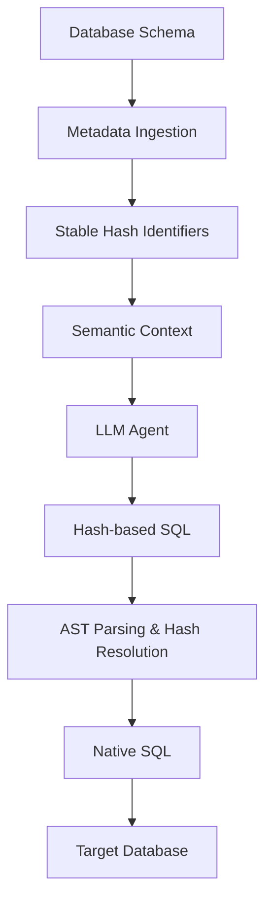
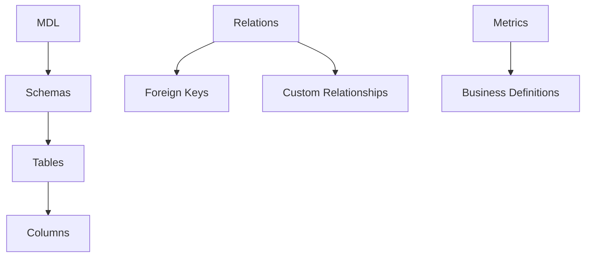
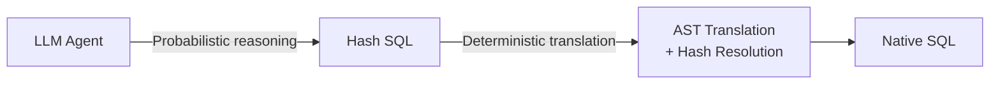
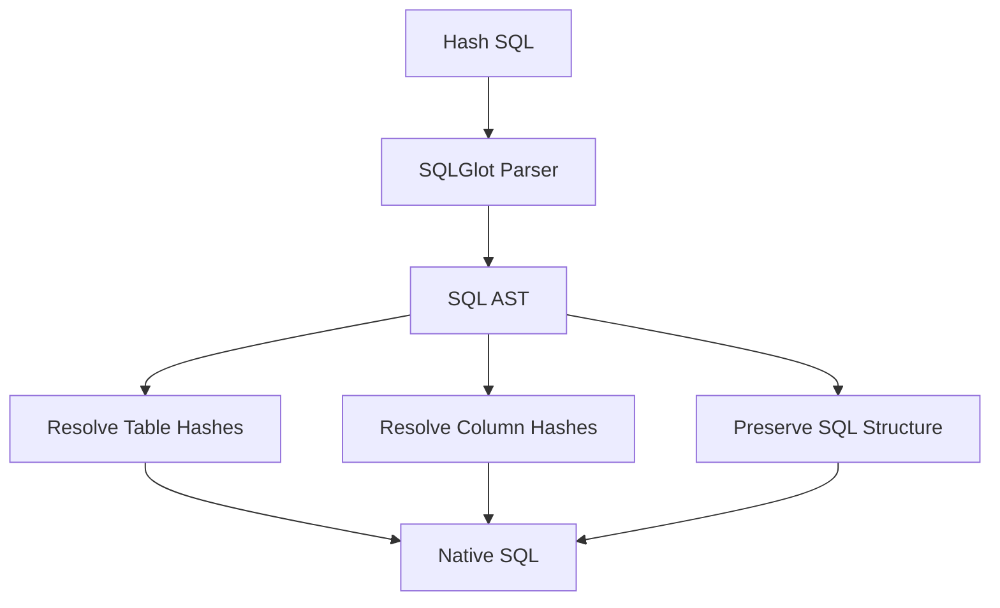
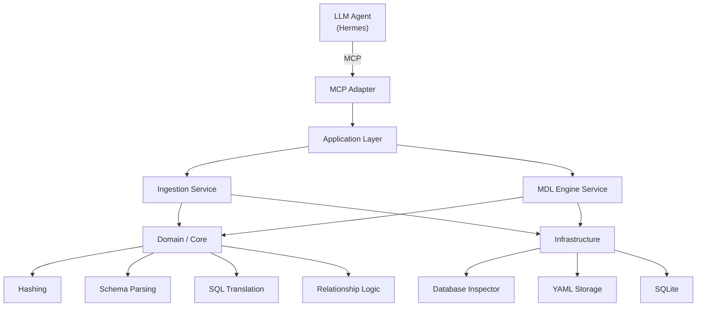
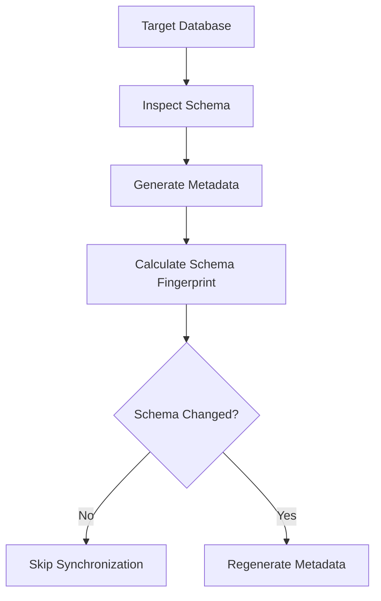
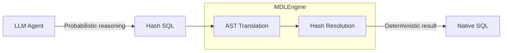

# MDLEngine

**Hash-based Semantic Layer for LLM-driven SQL Generation**

MDLEngine is a lightweight MCP server that acts as a semantic translation layer between an LLM agent and a relational database.

It allows an LLM to reason about database structure using **stable hash identifiers** instead of relying on raw database identifiers throughout its working context. The generated hash-based SQL is then deterministically translated back into native SQL before execution.

The core idea:



---

## Why MDLEngine?

LLM-based SQL generation introduces several problems when the model interacts directly with a database:

* Large schemas are difficult to reason about consistently.
* Identifiers can become ambiguous when many databases and connections are involved.
* Generated SQL is probabilistic and should not directly become executable SQL.
* Business relationships and semantic definitions often exist outside the physical database schema.
* The database schema may change and the semantic context needs to remain synchronized.

MDLEngine separates these concerns.

The LLM works with a semantic representation of the database, while MDLEngine is responsible for deterministic identifier resolution and SQL translation.

The hash identifiers are **not intended as a security or privacy boundary**. Their primary purpose is to provide stable object identity and reduce identifier ambiguity, especially when an agent needs to reason across multiple connections.

---

## Core Concepts

### 1. Opaque Schema Representation

Database objects are converted into deterministic hash identifiers.

The canonical internal path includes the connection alias and physical database identity:

```text
<alias>::<dbname>::<schema>::<table>::<column>
```

For example:

```text
staging::application::sales::orders::customer_id
```

becomes a stable hash identifier such as:

```text
h_8f31c2...
```

The original identifier is stored in an internal hashmap:

```text
h_8f31c2... → staging::application::sales::orders::customer_id
```

The `::` delimiter is simply the canonical internal representation used to construct hierarchical database paths before hashing. It is not a core feature by itself.

---

### 2. Semantic Metadata

MDLEngine represents database metadata through several semantic layers:



This allows the LLM to reason about the database beyond raw table definitions.

For example, the model can receive:

```text
h_a12f... = customer table
h_71bc... = order table
h_99d1... = customer_id
h_42ce... = order.customer_id
```

together with their relationships and business metadata.

---

### 3. Hash-based SQL Translation

The LLM does not produce native database SQL directly.

Instead, it produces SQL referencing the opaque identifiers:

```sql
SELECT
    h_customer_name,
    COUNT(h_order_id)
FROM h_customer
JOIN h_order
    ON h_customer_id = h_order_customer_id
GROUP BY h_customer_name;
```

MDLEngine parses the SQL into an AST using `sqlglot`, resolves the hash identifiers, and produces native SQL.

The important boundary is:



The LLM is responsible for **reasoning**.

MDLEngine is responsible for **deterministic translation**.

---

### 4. AST-based SQL Processing

Generated SQL is parsed into an Abstract Syntax Tree before identifier translation.

This avoids treating SQL as plain text replacement.



This also provides a controlled point where validation can be added before SQL reaches the target database.

---

### 5. MCP Interface

MDLEngine exposes its functionality through the Model Context Protocol (MCP), allowing an external agent such as Hermes to interact with the semantic layer as a collection of tools.

The MCP layer is an integration boundary; the semantic and translation logic remains independent from the agent itself.

---

## Architecture

MDLEngine follows a lightweight separation between domain logic, application services, infrastructure, and external interfaces.



The architecture is intentionally pragmatic. The purpose of the separation is to keep database access, persistence, MCP transport, and semantic transformations from being tightly coupled.

---

## Metadata Synchronization

MDLEngine can synchronize its metadata with the target database.

The synchronization flow is:



A schema fingerprint is used for change detection so that unchanged databases do not require unnecessary metadata regeneration.

The fingerprint is a synchronization mechanism and is separate from the hash identifiers used for database object identity.

---

## Metadata Storage

The current implementation stores generated MDL metadata as human-readable YAML files and internal state in SQLite.

Per-connection MDL files are stored under:

```text
~/.mdlEngine/
└── configs/
    └── local_mdl_<alias>.yaml
```

SQLite stores internal state in:

```text
~/.mdlEngine/
└── metadata.db
```

The SQLite database currently stores:

* Registered database connections
* Hash-to-canonical-path mappings
* Relationship metadata
* Schema fingerprints
* SQL translation audit logs

The alias is the logical identity used to address a connection. The physical `dbname` is connection metadata and does not need to be globally unique.

---

## MCP Tools

| Tool | Parameters | Description |
| --- | --- | --- |
| `list_connections` | None | Lists registered database connections. |
| `sync_database_metadata` | `alias`, connection information, `dialect`, `schema_name`, `force_reingest` | Inspects the target database and synchronizes semantic metadata. |
| `get_semantic_context` | `alias` | Returns the combined MDL, relations, and semantic metadata context for an LLM agent. |
| `parse_and_translate_sql` | `alias`, `hash_sql` | Parses hash-based SQL, resolves identifiers, and produces native SQL. |
| `save_dashboard_html` | `filename`, `html_content` | Saves generated dashboard/report artifacts. |

---

## Installation

From the project root:

```bash
pip install .
```

---

## Running with Hermes

MDLEngine is designed to run as a separate service alongside an agent such as Hermes.

A typical deployment uses Docker Compose with both services attached to the same Docker network:

```text
Hermes
  │
  │ MCP / SSE
  ▼
MDLEngine
  │
  ▼
Target Database(s)
```

The MDLEngine service listens on port `38000` for its SSE MCP transport. Within a Docker Compose network, Hermes can connect to the MDLEngine service using its Compose service name rather than a host IP.

For example, if the service is named `mdl-engine`:

```text
http://mdl-engine:38000
```

The exact MCP configuration depends on the Hermes deployment and its MCP client configuration.

---

## Design Principles

### Deterministic Core, Probabilistic Interface

MDLEngine intentionally separates probabilistic reasoning from deterministic execution.



The goal is not to eliminate LLM uncertainty.

The goal is to **keep uncertainty on the reasoning side of the boundary and make identifier translation deterministic**.

---

## Current Scope

MDLEngine currently focuses on:

* Database schema ingestion
* Hash-based identifier abstraction
* Semantic metadata representation
* Relationship metadata
* Hash-based SQL translation
* AST-based SQL processing
* MCP integration
* Metadata synchronization
* SQL translation auditing

---

## License

MIT License.
