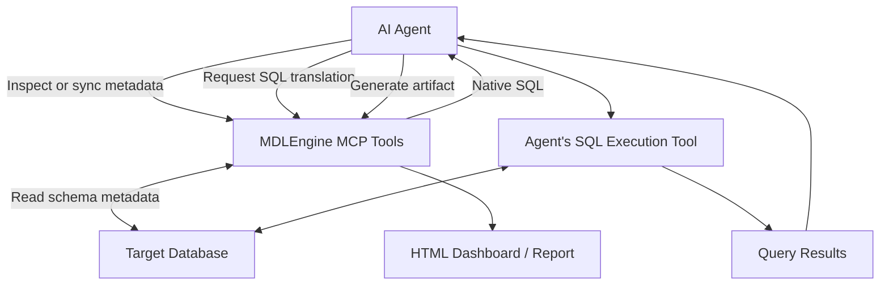
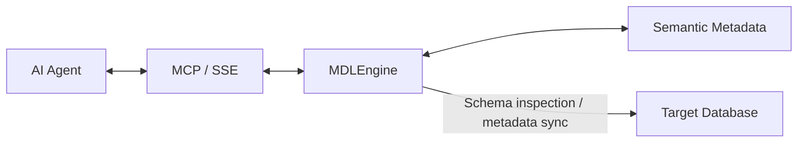

# MDLEngine

**A Semantic Layer for AI Agents, Exposed Through MCP**

MDLEngine is an MCP server that helps AI agents interact with relational databases through structured semantic metadata and SQL translation.

It provides tools for inspecting database metadata, retrieving semantic context, translating analytical queries into native SQL, and saving generated HTML dashboards or reports.

By separating database metadata management and SQL translation from agent reasoning, MDLEngine can be integrated into different AI-assisted data workflows.

## What Can MDLEngine Do?

- **Database Metadata Synchronization** — Inspect database schemas and synchronize metadata for use by AI agents.
- **Semantic Context Retrieval** — Provide information about tables, columns, relationships, and available business metadata.
- **SQL Translation** — Translate queries expressed using the engine's semantic representation into native SQL.
- **Dashboard and Report Output** — Save HTML artifacts generated by an AI agent.
- **Persistent Metadata** — Maintain configuration and internal metadata across container restarts when deployed with persistent storage.
- **MCP Integration** — Expose these capabilities as tools that compatible AI agents can invoke.

## Example Workflow

An AI agent can use MDLEngine as part of an analytical workflow:



For example, an agent can synchronize a PostgreSQL schema, retrieve the semantic context, ask MDLEngine to translate an analytical query, execute the resulting SQL through its own database tool, and save a dashboard generated from the returned results.

## MCP Tools

| Tool | Purpose |
| --- | --- |
| `list_connections` | List registered database connections. |
| `sync_database_metadata` | Inspect a target database and synchronize its metadata. |
| `get_semantic_context` | Retrieve semantic metadata for agent reasoning. |
| `parse_and_translate_sql` | Translate a semantic SQL query into native SQL. |
| `save_dashboard_html` | Save an HTML dashboard or report. |

The SQL translation tool returns SQL; it does not run that SQL against the database. The agent or a separate execution service is responsible for execution and retrieving query results.

## Architecture

MDLEngine sits between the agent and database metadata. It provides an MCP integration boundary around metadata ingestion, semantic context retrieval, and SQL translation.



The implementation uses SQLGlot for SQL parsing and transformation, YAML for generated MDL metadata, and SQLite for internal state and persistence. Metadata synchronization uses schema fingerprints to detect changes and avoid unnecessary regeneration when the schema has not changed.

## Installation

### Prerequisites

- Python 3.11+ for local installation
- Docker Engine and Docker Compose plugin for containerized deployment

### Local Installation

From the repository root:

```bash
pip install .
python -m src.main
```

The MCP server listens on port `38000`, with its SSE endpoint at:

```text
http://localhost:38000/sse
```

Keep the server running while an MCP client or agent connects to it.

### Docker Compose

Build and start the service:

```bash
docker compose -f compose.template.yaml build mdl-engine
docker compose -f compose.template.yaml up -d
docker compose -f compose.template.yaml ps
docker compose -f compose.template.yaml logs --tail=100 mdl-engine
```

The service exposes port `38000` on the host.

### Persistent Storage

| Container Path | Host Storage | Purpose |
| --- | --- | --- |
| `/root/.mdlEngine/configs` | `./data/configs` | MDL configuration files |
| `/root/.mdlEngine/outputs` | `./data/outputs` | Generated dashboards and reports |
| `/root/.mdlEngine/database` | Named volume `mdl_engine_metadata` | Internal SQLite database |

Avoid `docker compose down -v` if you need to preserve the named metadata volume.

## Integration with Hermes

MDLEngine can be connected to Hermes through MCP.

### 1. Install the Skill

From the repository root:

```bash
mkdir -p ~/.hermes/skills/mdlEngine
cp src/prompts/skills.md ~/.hermes/skills/mdlEngine/SKILL.md
```

Ensure the destination is inside the Hermes home directory used by the running agent. If Hermes runs in a container with a mounted home directory, copy the file in that environment or into the corresponding host-mounted directory.

### 2. Configure MCP

Add the following to `~/.hermes/config.yaml`, merging it with the existing configuration:

```yaml
mcp_servers:
  mdl-engine:
    url: http://mdl-engine:38000/sse
    enabled: true
```

The hostname `mdl-engine` must be reachable from Hermes. When both services run in Docker, they need to share a Docker network. In the tested local Compose setup, the network is `mdl-engine_default`. If Hermes runs in a separate container on the same Docker host, connect it to that network:

```bash
docker network connect mdl-engine_default <agent-container>
```

Replace `<agent-container>` with the actual Hermes container name or ID. If the network has a different name, inspect available networks with `docker network ls` and use the actual name.

### 3. Verify the Integration

Restart Hermes after changing the skill or MCP configuration. Verify that Hermes can discover and invoke MDLEngine's tools, not merely establish an MCP connection.

A typical analytical workflow is:

1. Discover or register the target connection using its logical alias.
2. Run `sync_database_metadata` when the connection is new or its metadata needs refreshing.
3. Retrieve `get_semantic_context`.
4. Construct a query in the engine's semantic representation and call `parse_and_translate_sql`.
5. Execute the returned native SQL using the agent's available database execution tool.
6. Use the query results to generate a dashboard or report and save it with `save_dashboard_html`.

## Initial End-to-End Validation

The initial local deployment was tested with Docker, PostgreSQL, and Hermes.

The reported workflow covered:

- Starting the MDLEngine container and connecting through MCP SSE.
- Synchronizing PostgreSQL metadata.
- Retrieving semantic context.
- Translating a query into native SQL.
- Using the query results in a patient demographics and payment dashboard workflow.
- Saving the generated HTML artifact.

The reported output path was:

```text
./data/outputs/patient_demographics_payment.html
```

This records the initial end-to-end validation. It does not claim automated integration coverage for every database dialect.

## Current Scope

MDLEngine currently focuses on:

- Database metadata ingestion and synchronization
- Semantic context retrieval
- SQL translation
- MCP integration
- Metadata persistence
- HTML artifact storage

SQL execution and analytical content generation remain outside MDLEngine's direct responsibility.

## License

MIT License.
