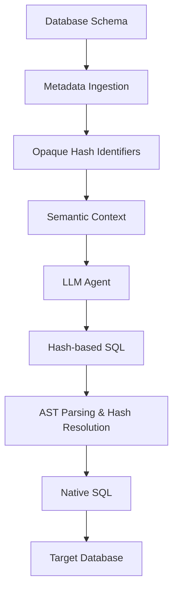
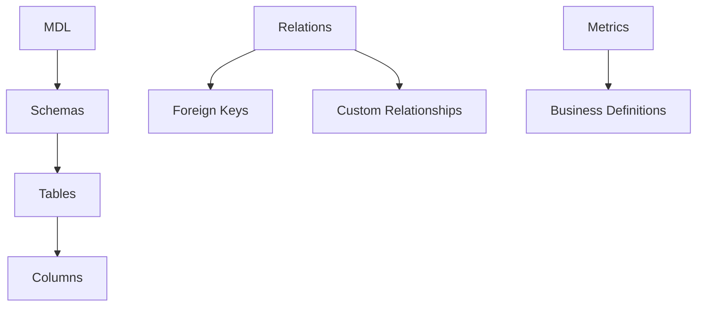
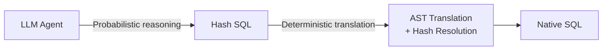
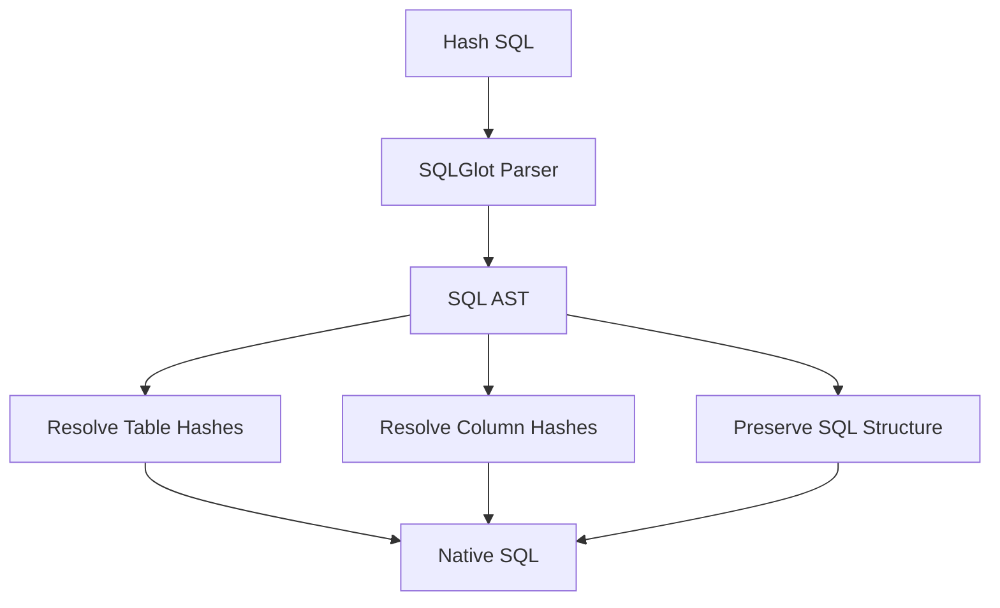
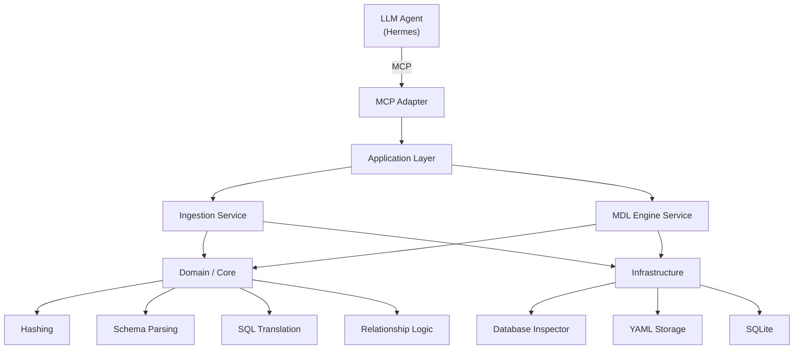
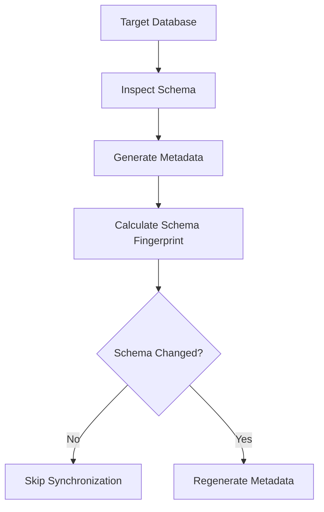
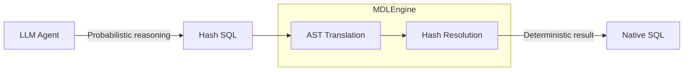

# MDLEngine

**Hash-based Semantic Layer for LLM-driven SQL Generation**

MDLEngine is a lightweight MCP server that acts as a semantic translation layer between an LLM agent and a relational database.

It allows an LLM to reason about database structure using **opaque hash identifiers** instead of exposing the original database identifiers directly. The generated hash-based SQL is then deterministically translated back into native SQL before execution.

The core idea:



---

## Why MDLEngine?

LLM-based SQL generation introduces several problems when the model interacts directly with a database:

* Database identifiers may contain sensitive or implementation-specific information.
* Large schemas are difficult to provide as raw context.
* Generated SQL is probabilistic and should not directly become executable SQL.
* Business relationships and semantic definitions often exist outside the physical database schema.
* The database schema may change and the semantic context needs to remain synchronized.

MDLEngine separates these concerns.

The LLM works with a semantic representation of the database, while MDLEngine is responsible for deterministic identifier resolution and SQL translation.

---

## Core Concepts

### 1. Opaque Schema Representation

Database objects are converted into deterministic hash identifiers.

For example:

```text
analytics::sales::orders::customer_id
```

becomes:

```text
h_8f31c2...
```

The original identifier is stored in an internal hashmap:

```text
h_8f31c2... → analytics::sales::orders::customer_id
```

The `::` delimiter is simply the canonical internal representation used to construct hierarchical database paths before hashing. It is not a core feature by itself.

---

### 2. Semantic Metadata

MDLEngine represents database metadata through several semantic layers:



This allows the LLM to reason about the database beyond raw table definitions.

For example, the model can receive:

```text
h_a12f... = customer table
h_71bc... = order table
h_99d1... = customer_id
h_42ce... = order.customer_id
```

together with their relationships and business metadata, without requiring the original identifiers in its working context.

---

### 3. Hash-based SQL Translation

The LLM does not produce native database SQL directly.

Instead, it produces SQL referencing the opaque identifiers:

```sql
SELECT
    h_customer_name,
    COUNT(h_order_id)
FROM h_customer
JOIN h_order
    ON h_customer_id = h_order_customer_id
GROUP BY h_customer_name;
```

MDLEngine parses the SQL into an AST using `sqlglot`, resolves the hash identifiers, and produces native SQL:

```sql
SELECT
    customer.name,
    COUNT(orders.id)
FROM customer
JOIN orders
    ON customer.id = orders.customer_id
GROUP BY customer.name;
```

The important boundary is:



The LLM is responsible for **reasoning**.

MDLEngine is responsible for **deterministic translation**.

---

### 4. AST-based SQL Processing

Generated SQL is parsed into an Abstract Syntax Tree before identifier translation.

This avoids treating SQL as plain text replacement.



This also provides a controlled point where validation can be added before SQL reaches the target database.

---

### 5. MCP Interface

MDLEngine exposes its functionality through the Model Context Protocol (MCP), allowing an external agent such as Hermes to interact with the semantic layer as a collection of tools.

The MCP layer is an integration boundary; the semantic and translation logic remains independent from the agent itself.

---

## Architecture

MDLEngine follows a lightweight separation between domain logic, application services, infrastructure, and external interfaces.



The architecture is intentionally pragmatic. The purpose of the separation is to keep database access, persistence, MCP transport, and semantic transformations from being tightly coupled.

---

## Metadata Synchronization

MDLEngine can synchronize its metadata with the target database.

The synchronization flow is:



A schema fingerprint is used for change detection so that unchanged databases do not require unnecessary metadata regeneration.

The fingerprint is a synchronization mechanism and is separate from the hash identifiers used for database object abstraction.

---

## Metadata Storage

The current implementation stores generated metadata as human-readable YAML files.

```text
~/.src/
└── configs/
    ├── mdl.yaml
    ├── hashmap.yaml
    ├── relations.yaml
    └── metrics.yaml
```

### `mdl.yaml`

Contains the structural database metadata:

```text
Database
└── Schema
    └── Table
        └── Column
```

### `hashmap.yaml`

Stores the mapping between opaque identifiers and their canonical database paths.

```text
h_xxx → database::schema::table
h_yyy → database::schema::table::column
```

### `relations.yaml`

Contains relationships that may not be fully represented by physical foreign keys.

### `metrics.yaml`

Contains business-level definitions used when constructing semantic context for the LLM.

These files are intentionally human-readable and editable.

---

## Internal Registry

SQLite is used for internal application state that is not part of the semantic metadata itself.

Typical responsibilities include:

* Registered database connections
* Metadata synchronization state
* SQL translation audit logs
* Internal application metadata

```text
~/.mdlEngine/
└── metadata.db
```

SQLite is an implementation detail and can be replaced without changing the semantic translation model.

---

## MCP Tools

| Tool                      | Parameters                                                                   | Description                                                                |
| ------------------------- | ---------------------------------------------------------------------------- | -------------------------------------------------------------------------- |
| `list_connections`        | None                                                                         | Lists registered database connections.                                     |
| `sync_database_metadata`  | `dbname`, connection information, `dialect`, `schema_name`, `force_reingest` | Inspects the target database and synchronizes semantic metadata.           |
| `get_semantic_context`    | `dbname`                                                                     | Returns the combined MDL, relations, and metrics context for an LLM agent. |
| `parse_and_translate_sql` | `dbname`, `hash_sql`                                                         | Parses hash-based SQL, resolves identifiers, and produces native SQL.      |
| `save_dashboard_html`     | `filename`, `html_content`                                                   | Saves generated dashboard/report artifacts.                                |

---

## Installation

### Install MDLEngine

From the project root:

```bash
pip install .
```

---

## Running with Hermes

MDLEngine can be installed directly into an existing Hermes container.

### 1. Copy the package

From the MDLEngine project directory:

```bash
docker cp . <hermes_container>:/tmp/mdl_engine
```

### 2. Install

```bash
docker exec -it <hermes_container> \
    pip install /tmp/mdl_engine
```

### 3. Generate Agent Skills

```bash
docker exec -it <hermes_container> \
    python3 -m src.ports_in.mcp.setup_skills
```

### 4. Register the MCP Server

Add MDLEngine to the Hermes MCP configuration:

```json
{
  "mcpServers": {
    "mdl_engine": {
      "command": "mdl-engine"
    }
  }
}
```

---

## Design Principles

### Deterministic Core, Probabilistic Interface

MDLEngine intentionally separates probabilistic reasoning from deterministic execution.



The goal is not to eliminate LLM uncertainty.

The goal is to **keep uncertainty on the reasoning side of the boundary and make identifier translation deterministic**.

---

## Current Scope

MDLEngine currently focuses on:

* Database schema ingestion
* Hash-based identifier abstraction
* Semantic metadata representation
* Relationship metadata
* Business metric metadata
* Hash-based SQL translation
* AST-based SQL processing
* MCP integration
* Metadata synchronization
* SQL translation auditing

---

## License

MIT License.
